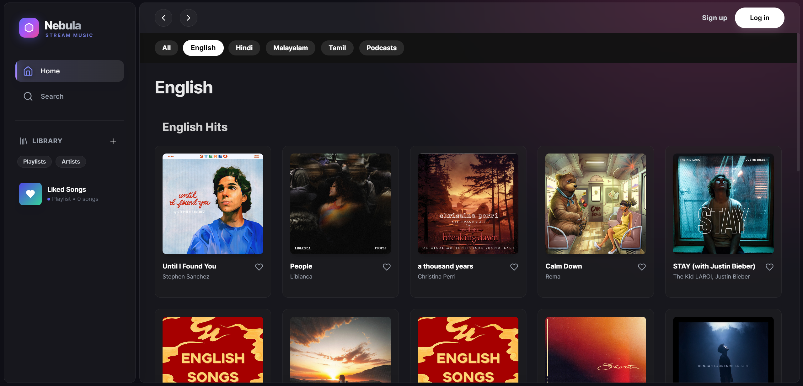
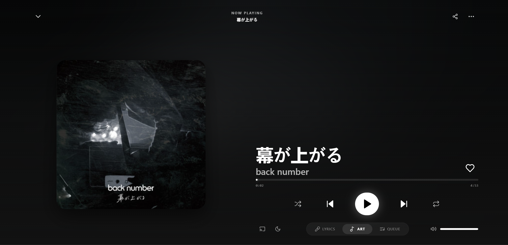

# 🌌 Nebula Music
### The Ultimate Open Source Audio Streaming Architecture



[](LICENSE)
[](https://github.com/ellerbrock/open-source-badges/)
[](https://reactjs.org/)
[](https://nodejs.org)
[](https://www.mongodb.com/)
[](https://tailwindcss.com/)
[](http://makeapullrequest.com)

**Nebula Music** is a high-fidelity **Spotify Clone** and **Audio Streaming Platform** engineered with the MERN stack. Unlike typical clones, Nebula focuses on **production-grade architecture**, featuring advanced state management, optimistic UI updates, and a fully responsive glassmorphism design system that adapts seamlessly from desktop to mobile.

---

## 🚀 Key Technical Highlights

### 📱 Unified Responsive Architecture
A single codebase delivering two distinct, optimized experiences:
*   **Desktop "Cinema" Mode**: Features a dual-column layout, keyboard shortcuts (`Space`, `M`, `Arrows`), and a side-by-side view for Lyrics/Queue.
*   **Mobile "App" Experience**: A touch-optimized interface with swipeable tabs, heavy usage of bottom sheets, and a floating mini-player.
*   *Implementation*: Leverages TailwindCSS `md:` breakpoints and conditional React rendering to serve the right layout without code duplication.

### ⚡ State Management & Audio Engine
*   **React Context API**: Manages global audio state (play/pause, seek, volume) to prevent unnecessary re-renders across the component tree.
*   **Custom Audio Wrapper**: A robust abstraction over the HTML5 Audio API that handles:
    *   Gapless playback simulation.
    *   Auto-queue advancement.
    *   Error recovery and stream buffering.

### 🎨 Glassmorphism Design System
*   Built with a custom Tailwind configuration.
*   Features dynamic background color extraction from album art.
*   Uses `backdrop-blur` extensively for a modern, premium feel.

---

## 🛠️ Technology Stack

| Domain | Tech | Use Case |
| :--- | :--- | :--- |
| **Frontend** | React 18 (Vite) | FAST Component rendering. |
| **Styling** | TailwindCSS | Utility-first responsive design. |
| **Icons** | Lucide React | Lightweight, consistent iconography. |
| **Backend** | Node.js + Express | RESTful API architecture. |
| **Database** | MongoDB | Storing users, playlists, and metadata. |
| **Auth** | JWT (JSON Web Tokens) | Secure stateless authentication. |
| **External** | YouTube & Spotify APIs | Mock/Proxy data fetching. |

---

## 📸 Screen Previews

### Desktop "Pro" Player


### Mobile Interface


---

## 🏁 Getting Started Locally

Getting Nebula Music running on your machine is simple.

### Prerequisites
*   Node.js (v18 or higher)
*   MongoDB (Run locally or use MongoDB Atlas)

### 1. Installation
Clone the repository:
```bash
git clone https://github.com/AmanTShekar/nebula-spotify-clone.git
cd nebula-spotify-clone
```

### 2. Backend Setup
Navigate to the server folder and install dependencies:
```bash
cd server
npm install
```
Create a `.env` file in `server/` with your credentials:
```env
PORT=5000
MONGO_URI=mongodb://localhost:27017/nebula
JWT_SECRET=your_super_secret_key_123
```
Start the server:
```bash
npm run dev
# Server runs on http://localhost:5000
```

### 3. Frontend Setup
Open a new terminal, navigate to the client folder:
```bash
cd client
npm install
```
Start the React app:
```bash
npm run dev
# App runs on http://localhost:5173
```

---

## 🤝 Contributing

We welcome contributions! Please see our [Contributing Guide](CONTRIBUTING.md) for details.

1.  Fork the Project
2.  Create your Feature Branch (`git checkout -b feature/AmazingFeature`)
3.  Commit your Changes (`git commit -m 'Add some AmazingFeature'`)
4.  Push to the Branch (`git push origin feature/AmazingFeature`)
5.  Open a Pull Request

---

## 📜 License

**Educational Use Only**. See `LICENSE` for more information.
This project is for educational and portfolio purposes. 

---

*Built with ❤️ by [Aman T Shekar](https://github.com/AmanTShekar)*
